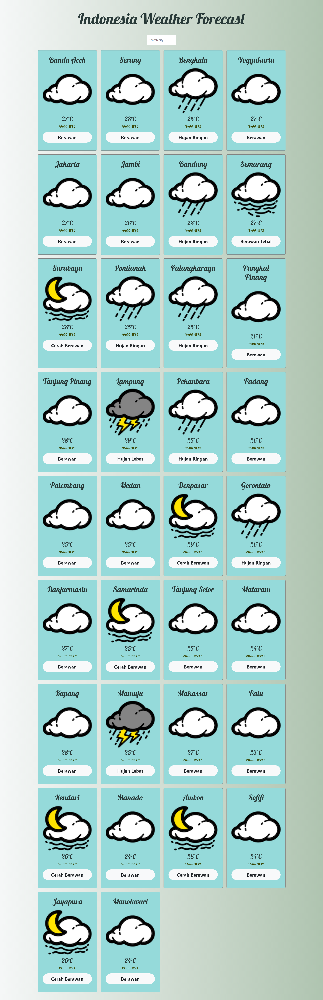

# React.js - Consume API from Django

The FrontEnd of Django3 Application that consume BmkgInfo Library https://github.com/endang-ismaya/django3-bmkginfo-jsonresponse

## Run Project

```bash
npm start
```

## Preview

### HomePage



## License

[MIT](https://choosealicense.com/licenses/mit/)
